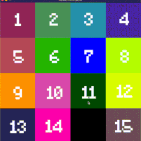
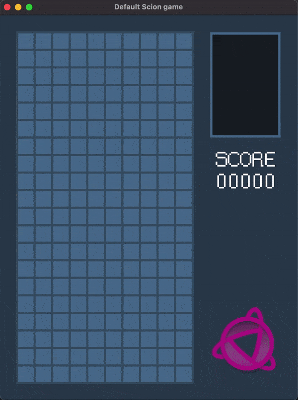
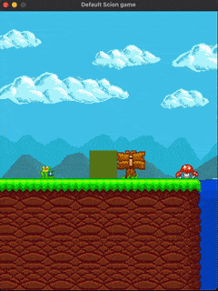
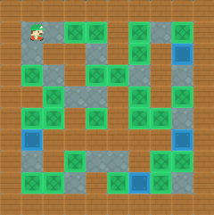
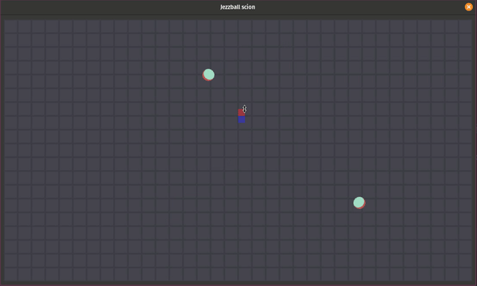

Scion is a 2D game library made in rust. 

> Please note that this project is in its first milestones and is subject to change according to convenience needs and big features coming.
> You can use Scion as you want although I just made this open source to serve the community not to be a competitor to the current Rust game engine eco-system.

## Why this project ? 

Well, firstly because it' a good way to learn the different aspects of game dev under the hood. 
Then, because I wanted to create something with modest goals, focused on ease of use and a short list of principles that also serves as a guideline.

Scion is not 'inspired' by any other engine, it's inspired by the needs from real projects. 

### Goals

- Strong focus on **2D** only.
- **Easy** and **Fun** to use.
- Clean and readable source code
- Tauri based Editor

### Non goals

- Ultra/over optimized code and performances. For this, please try other engines or build your own !
- 3D

## Documentations, Tutorials ?

Yes, they are planned and being worked on. If you want to see scion in action, check the examples for now.

## Why ECS ?

Today, ECS is like a 'magic' word for games, game libs and game engine. But ECS is not and must not be considered as a universal answer to multiple questions.
I believe that ECS has its strength and its weaknesses. 
The choice of it here is made because the main target games of this lib at its start were to be able to make : 
- a complex city building game.
- a pkmn fan game with real time trainer progression and wild pkmn.
- granular network packets representation && dot simulation games.

## Notable dependencies

These are the dependencies this project is relying on. Thanks to these awesome communities, we are able to build this kind of tiny projects. 

- <a href="https://github.com/rust-windowing/winit" target="blank">winit</a> and <a href="https://github.com/gfx-rs/wgpu/tree/master/wgpu" target="blank">wgpu</a> (windowing and multi backend rendering)
- <a href="https://github.com/amethyst/legion" target="blank">legion</a> (Entity component system)
- <a href="https://github.com/termhn/ultraviolet" target="blank">ultraviolet</a> (Maths)

## Pre-requisite

### Debian, Ubuntu, PopOS...

To build the project you'll need to install these first : 
```sh
sudo apt install gcc cmake build-essential libx11-dev libxi-dev libgl1-mesa-dev libasound2-dev
```

### Fedora

To build the project you'll need to install these first : 
```sh
sudo dnf install gcc cmake make automake gcc gcc-c++ kernel-devel libX11-devel libXi-devel mesa-libGL-devel alsa-lib-devel
```

### Run an example

Then, you can run an example :
```sh
cargo run --example bomberman --release
```

## Showcase

|   |   |  |
| ------------- | ------------- | ------------- |
|  |  | |


